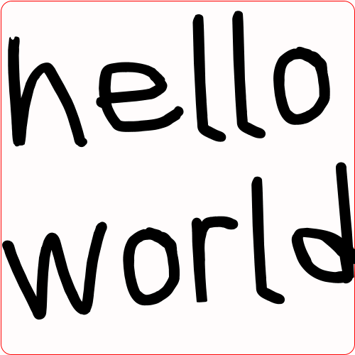

# image-box
A C# API for creating PNGs and GIFs from vue-like templates

## Installation
You can install the NuGet package:
```bash
PM> Install-Package ImageBox
```

## Setup
You can either add the ImageBox library to your project using either Dependency Injection or by using the `ImageBoxUtility` class.

### Usage
This is the preferred method of using this library as it gives you more control how the library is used. 
You can add the ImageBox library to your services like so:
```csharp
using ImageBox;

//Get these from your application
IConfiguration config;
IServiceCollection services;

//Register the ImageBox library with your services
services.AddImageBox(config);

...

using ImageBox;

//Fetch this from your services
IImageBoxService _imageBox;

//Get your template and image output paths
var template = "template.html";
var outputDir = "output";
var outputName = "some-image";

//Get the image context and services
var image = _imageBox.Create(template);	
var context = await _imageBox.LoadContext(image);

//Determine the output path
var outputExt = context.Animate ? "gif" : "png";
var outputPath = Path.Combine(outputDir, $"{outputName}.{outputExt}");

//Render the image
await _imageBox.Render(ouputPath, image);
```

You can see an example of this method in the `ImageBox.Cli` project.

### ImageBoxUtility
You can use the `ImageBoxUtility` class to create images like so:
```csharp
using ImageBox;

var inputPath = "template.html";
var outputPath = "output.gif";

var ib = ImageBoxUtility.From(inputPath);
await ib.Render(outputPath);
```


### Examples
You can check the various examples used in the `ImageBox.Cli` project.

Here is an example of an image-box template:
```html
<template width="500px" height="500px" animate animate-duration="3.5s" animate-fps="30">
  <clear color="white" />
  <rectangle {rect} border-color="red" border-width="2px" radius="15" />
  <text {text} font-family="font" color="black" rotate="-5" auto-font-size auto-font-size-padding="15" />
</template>

<cache>
  <font-family name="font" src="https://fonts.cdnfonts.com/s/21809/ScribblerBd.woff" />
</cache>

<script setup>
import { Drawing, Context, logger } from 'system';

export default (ctx) => {
  const { unit, bounds, point } = new Drawing(ctx);
  const { get, progressOne, pulsate, progress } = new Context(ctx);

  const width = unit('100vw');
  const height = unit('100vh');

  const messages = [
    'hello world',
    'how are you?',
    'I hope you are well.',
    'Good bye!'
  ];

  const text = {
    'align-vertical': 'center',
    'align-horizontal': 'center',
    'align-text': 'center',
    'origin-type': 'center',
    value: progressOne(messages),
    width: width,
    height: height,
    x: 0,
    y: 0
  };

  const portions = 4;
  const borderWidth = pulsate('1px', '10px')
  const topLeft = point(borderWidth / 2, borderWidth / 2);
  const bottomRight = point(width - borderWidth / 2, height - borderWidth / 2);
  const rect = {
    ...bounds(topLeft, bottomRight),
    'border-width': borderWidth
  };

  return {
    text,
    rect
  }
};  
</script>
```
This will generate the following GIF:


### Element References
You can see a list of the elements and types that are supported [here](./ELEMENTS.md)